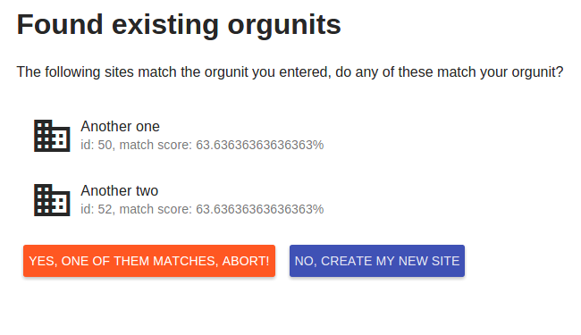

 

DHIS2 Org Unit app
==================

A custom DHIS2 app to manage adding new orgunits, which supports matching of existing orgunits using an external matching service.

Install deps with `npm install`

Package up the DHIS2 app with `npm run package`, this will export the app to a .zip file

Deploy the app to a local DHIS2 instance with `npm run deploy`

Run and develop with `npm run serve`

Test with `npm test`
